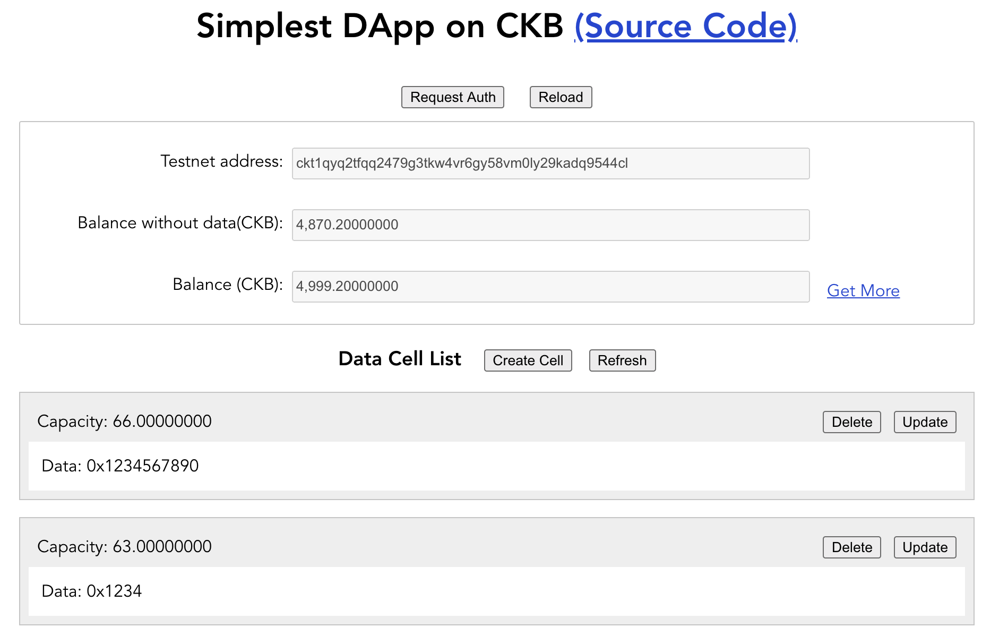
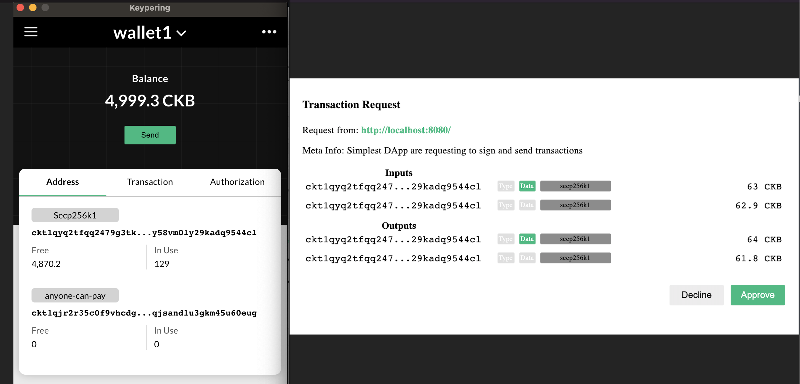

# Simplest DApp on Nervos CKB

[Live Demo](https://prototype.ckbapp.dev/simplest-dapp/)

## What is Simplest DApp

Simplest DApp is a simple DApp on [Nervos CKB](https://www.nervos.org/) which allow user to create, update and delete cell data.

Simplest DApp is an example for [Nervos CKB](https://www.nervos.org/) developers to start to develop their own DApps.  



## How Simplest DApp Work

Simplest DApp never touch users' private keys and it's all operations which need private keys will delegate [Keypering](https://github.com/nervosnetwork/keypering) to complement. [Keypering](https://github.com/nervosnetwork/keypering) is a desktop wallet that manages user's private keys and lock scripts and responds to requests from DApps.



For example, when Simplest DApp need to sign transaction, it will send request to [Keypering](https://github.com/nervosnetwork/keypering) and delegate it to sign transaction with its' private keys and return signed transaction to Simplest DApp. 

### Workflow

1. Send a request to [Keypering](https://github.com/nervosnetwork/keypering) to get authorization token (Click Request Auth button)

2. Fetch addresses information (addresses, lock scripts and lock hashes) from [Keypering](https://github.com/nervosnetwork/keypering) with authorization token

3. Fetch live cells from [CKB Rich Node](https://github.com/ququzone/ckb-rich-node) with lock hashes and show cell list

4. Create a new transaction whose output data is filled with input content (Click Create Cell button)

5. Send the transaction to [Keypering](https://github.com/nervosnetwork/keypering) to delegate Keypering to sign and send transaction to CKB

6. Update cell list after the transaction successfully sent 

7. Update or delete the cell data by sending transaction and delegating [Keypering](https://github.com/nervosnetwork/keypering) to sign and send transaction to CKB (Click Update or Delete buttons)

> Note: Every transaction that has been sent to CKB successfully will be viewed on [Nervos CKB Explorer](https://explorer.nervos.org/) which includes [Mainnet](https://explorer.nervos.org/) and [Testnet](https://explorer.nervos.org/aggron/).

> Note: [CKB Rich Node](https://github.com/ququzone/ckb-rich-node) includes [ckb node](https://github.com/nervosnetwork/ckb) and [ckb indexer](https://github.com/nervosnetwork/ckb-indexer) and [Keypering Agency Protocol](https://nervosnetwork.github.io/keypering/#/protocol) document will be helpful for you.

## Build Setup

Requires Node.js 8+

```shell
git clone https://github.com/duanyytop/simplestdapp.git

cd simplestdapp

# install dependencies
yarn install

# serve in dev mode, with hot reload at localhost:8080
yarn serve

# build for production
yarn build
```

## Resources

- [Keypering Agency Protocol](https://nervosnetwork.github.io/keypering/#/protocol) - DApp Developer Guide of Keypering
- [CKB Rich Node](https://github.com/ququzone/ckb-rich-node) - Remote server which includes [ckb node](https://github.com/nervosnetwork/ckb) and ckb indexer
- [CKB Indexer](https://github.com/quake/ckb-indexer) - Core Module of CKB Rich Node
- [CKB Explorer](https://explorer.nervos.org)
- [CKB Faucet](https://faucet.nervos.org)